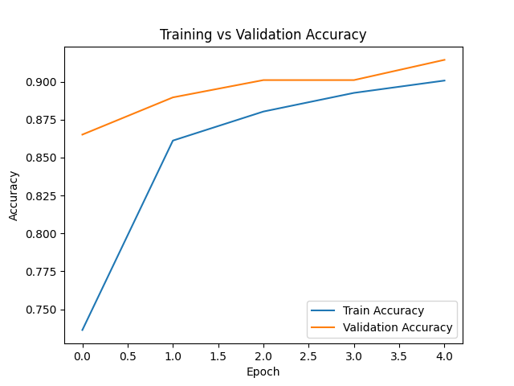
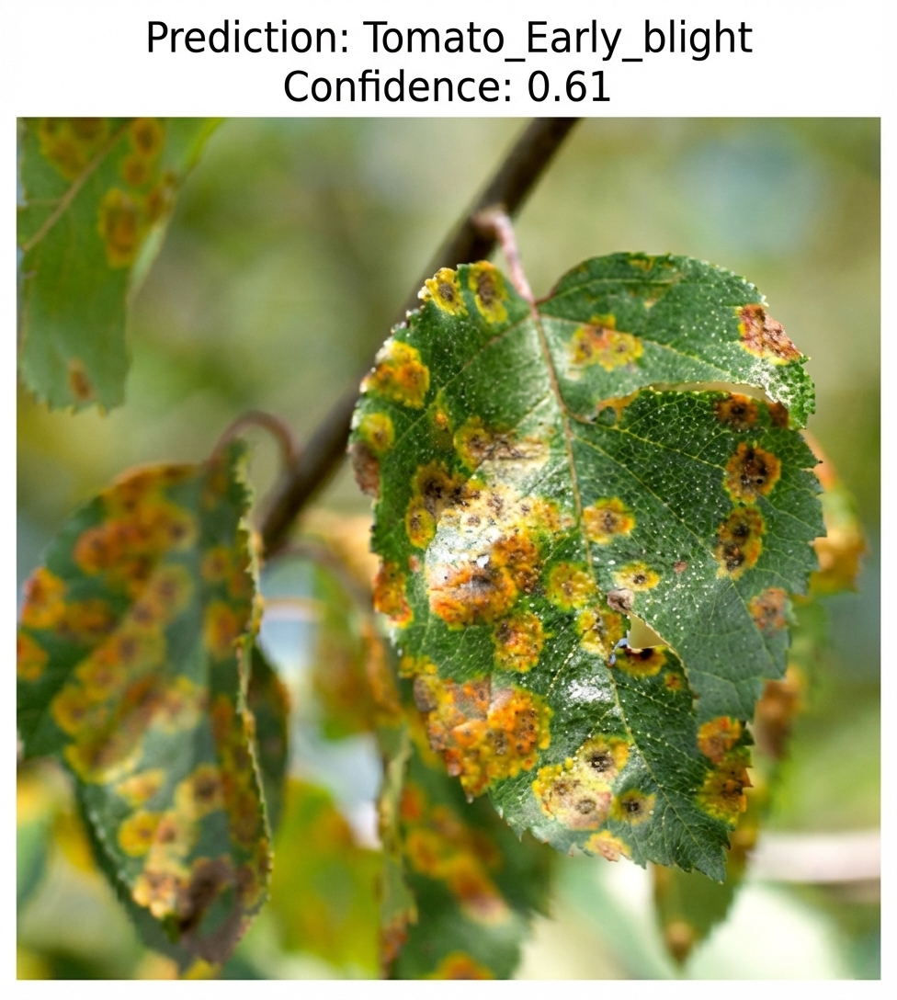
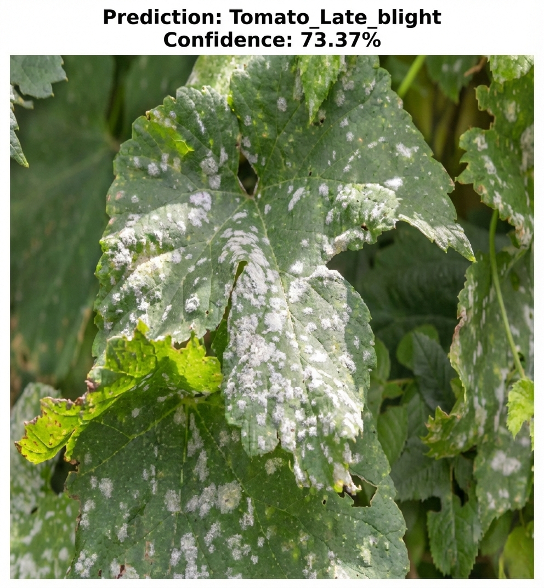

<p align="center">
  
</p>

<h2 align="center">Smart Crop Disease Detection using Deep Learning</h2>

<p align="center">
  Achieved <b>91.44% validation accuracy</b> using MobileNetV2 Transfer Learning
</p>


---

## Project Overview

Farmers often struggle to identify crop diseases at early stages, leading to reduced yield and financial losses.

This project builds an **AI-powered crop disease detection system** that:

- Takes a leaf image as input  
- Classifies the disease  
- Displays confidence score  
- Suggests basic treatment  

---

## Model Architecture

- Base Model: **MobileNetV2 (Transfer Learning)**
- Input Size: 224 × 224 × 3
- Output Classes: 15 crop disease categories
- Optimizer: Adam
- Loss Function: Categorical Crossentropy

---

## Training Performance

<p align="center">
  
</p>

- Training Accuracy: ~90%
- Validation Accuracy: **91.44%**
- Minimal overfitting observed

---

## Demo Predictions

### Example 1
<p align="center">
  
</p>

### Example 2
<p align="center">
  
</p>

---

## Tech Stack

- Python  
- TensorFlow / Keras  
- NumPy  
- Matplotlib  
- Google Colab  

---

## Project Structure

```
Smart-Crop-Disease-Detection/
│
├── Crop_Disease_Detection.ipynb
├── predict.py
├── requirements.txt
├── README.md
├── images/
│   ├── training_accuracy.png
│   ├── demo_prediction.png
│   └── demo_prediction_2.png
└── model/
    └── final_crop_disease_model.h5
```

---

## How to Run

### Install Dependencies

```bash
pip install -r requirements.txt
```

### Run Prediction

```bash
python predict.py test.jpg
```

---

## Social Impact

This system can help:

- Farmers detect diseases early  
- Reduce crop loss  
- Improve agricultural productivity  
- Reduce excessive pesticide usage  

---

## Future Improvements

- Fine-tuning for higher accuracy  
- Deployment as Streamlit Web App  
- Multilingual farmer interface  
- Expanded treatment database  

---

## Author

Prajith Arjunan S
B.Tech Computer Science 
